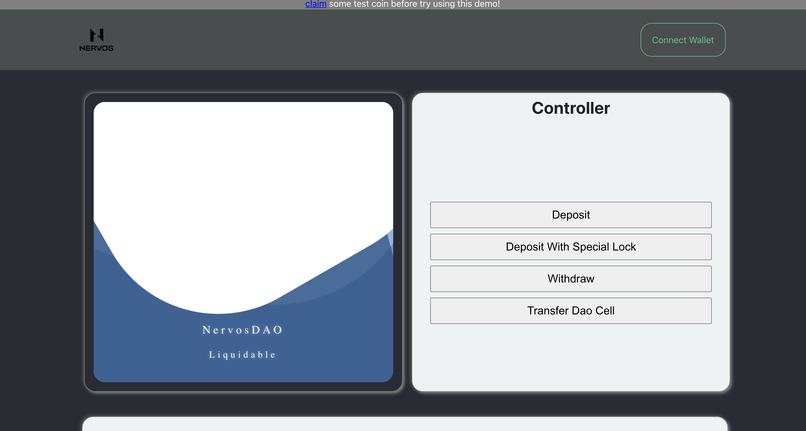

# Liquidable NervosDAO Contract 

The repo contains the code of a capsule project for [liquidable dao dapp](https://github.com/RetricSu/liquidable-dao-dapp)'s smart contract, which is a special lock script used by special cells deposited in NervosDAO contract.

This special lock script gives the cell the ability to staking / transfer / participate in defi and other on-chain activities just like other normal cells while still earning the compensation from NervosDAO.

## Development

check out this [docs](https://github.com/RetricSu/liquidable-nervos-dao-contract/blob/master/docs/getting_started.md)

## Learn More

- [dapp](https://github.com/RetricSu/liquidable-dao-dapp)
- walk-through video - [Dapps On CKB: Building A Liquidable DAO workshop]()

### Process Flow Of the Contract

1. load this current script, extract the args from script, let's call the args ID.
2. load the input cell in current tx, and loop for puppet cell whose type hash is matching with ID
3. if no puppet cell is found, return failed
4. if more than one puppet cell is found, return failed, that emplies the type-id script must go wrong
5. if only one puppet cell is found, load the cell data field and extract the public key
6. load tx witnesses and recover the signing public key from signature
7. verify if two public key is matched. if is matched, return success. otherwiese, return failed